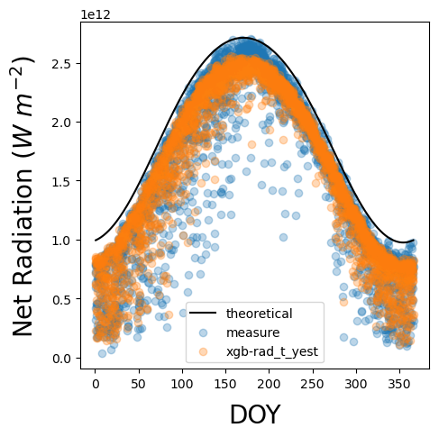

# Netrad
This repository covers a series of machine-learning-based models that predict net radiation using minimum climatological data.

The model ID, input variables, and database used for model construction are shown in the table below.

| Model_ID       | Input Variables     | Database     |
| :------------- | :-----------------: | -----------: |
| rad            | rad_avg_W_sqm + rad_std_W_sqm + rad_max_W_sqm + day_len_hr + rad_tot_J_sqm | CA_CIMIS + AZ_AZMET |
| rad_t          | rad_avg_W_sqm + rad_std_W_sqm + rad_max_W_sqm + day_len_hr + rad_tot_J_sqm    T_max + T_min + T_avg + T_rng | CA_CIMIS + AZ_AZMET |
| rad_t_yest     | rad_avg_W_sqm + rad_std_W_sqm + rad_max_W_sqm + day_len_hr + rad_tot_J_sqm    T_max + T_min + T_avg + T_rng   T_max_yest + T_min_yest + T_avg_yest | CA_CIMIS + AZ_AZMET |

A brief overview of the results is shown in the figures below. Figure 1 shows the observation stations where we collected the data.

||
|:--:|
|* Figure 1. Geographical Location and Elevation of Radiation Stations*|

Figure 2 shows the model performance using the prediction vs. observation plot. Here we only showed the results generated from gradient boosted tree models.

||
|:--:|
|* Figure 2. Predicted vs. Observed Net Radiation using a Gradient Boosted Tree Model*|

Figure 3 shows the time series of theoretical, predicted and observed net radiation at one station in California.

||
|:--:|
|* Figure 3. Theoretical, Predicated, and Observed Net Radiation against using a Gradient Boosted Tree Model at one station in California*|

Through the following code, we can make net radiation forecast based on the weather forecasting at the real time.

'''{
import nws_forecast
from nws_forecast import forecast

my_forecast = forecast(city="Merced, CA", model_type ='lm')
my_forecast.request_nws()
from class_model import model
my_forecast.export_forecast()
my_forecast.plot_forecast()
print(my_forecast.model_id, my_forecast.pred_time)
}'''
