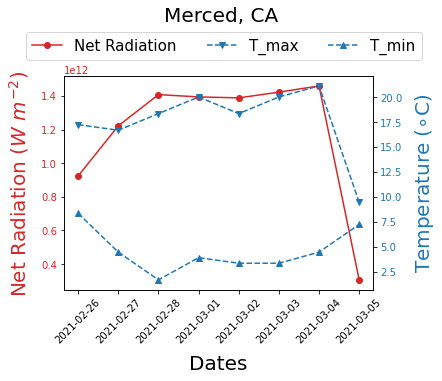
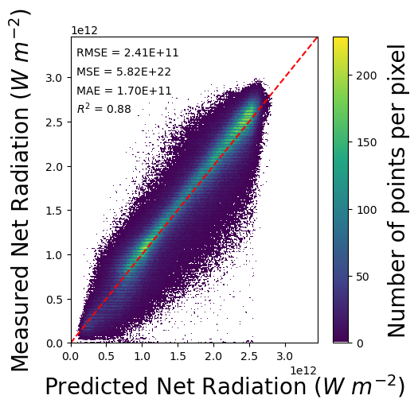

# Machine-learning Based Net Radiation Forecaster 

## Overview
This repository was created for the machine-learning forecasters that predict net radiation using minimum weather information, e.g., temperature. It pulls data from the [National Weather Service (NWS) API](https://www.weather.gov/documentation/services-web-api) for customized location and forecasts the net radiation.

## Features
* The model built was based on five popular machine learning algorithms, including multi-linear regression, K nearest neighbor, support vector machine, random forests, and gradient boosted tree regression.
* The dataset for model construction was collected from the [CIMIS](https://cimis.water.ca.gov/Default.aspx) and [AZMET](https://cals.arizona.edu/AZMET/) from 1982 to 2018.
* Extracting [ERA5](https://www.ecmwf.int/en/forecasts/dataset/ecmwf-reanalysis-v5) reanalysis global climate dataset for forecast validation.
* Forecasting 7-day net radiation from the running date after automatically extracting weather forecasting information from NWS.
<p align="center">

<<<<<<< HEAD
    <b>Figure 1</b>. Geographical location of observation station
=======
Figure 1. Geographical location of observation station
>>>>>>> 2c6631185c46a904f99a68951903cd616e1d5ec5
</p>

## Running The Forecaster
```
import nws_forecast
from nws_forecast import forecast

# request weather forecast from NWS
my_forecast = forecast(city="Merced, CA", model_type ='lm')
my_forecast.request_nws()

# proceed the forecast and plot the forecast results
from class_model import model
my_forecast.export_forecast()
my_forecast.plot_forecast()
```
An expected output is shown below:
<p align="center">

<<<<<<< HEAD
    <b>Figure 2</b>. Net radiation forecasting at Merced, CA
=======
Figure 2. Net radiation forecasting at Merced, CA
>>>>>>> 2c6631185c46a904f99a68951903cd616e1d5ec5
</p>

## Other Model Preview

<p align="center">

<<<<<<< HEAD
    <b>Figure 3</b>. Theoretical, predicated, and observed net radiation against time using a Gradient Boosted Tree Model at one location in California.
</p>

<!-- **Figure 3**. Theoretical, predicated, and observed net radiation against time using a Gradient Boosted Tree Model at one location in California. -->

<!-- **SUGGESTION**: consider plotting 1:1 format for all sites. -->

<p align="center">

    <b>Figure 4</b>. Predicted against observed net radiation using a Random Forest Model for all stations in California and Arizona.
=======
</p>

**Figure 3**. Theoretical, predicated, and observed net radiation against time using a Gradient Boosted Tree Model at one location in California.

**SUGGESTION**: consider plotting 1:1 format for all sites.

<p align="center">

Figure 4. Predicted against observed net radiation using a Random Forest Model for all stations in California and Arizona.
>>>>>>> 2c6631185c46a904f99a68951903cd616e1d5ec5
</p>


